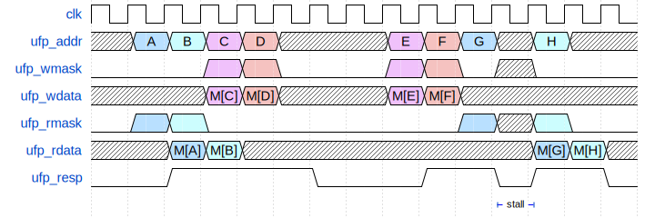
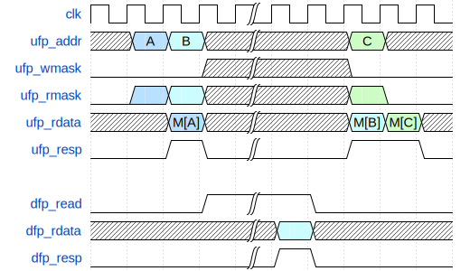
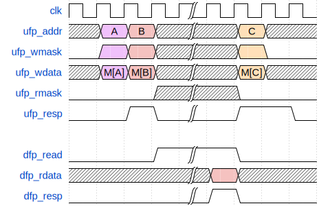
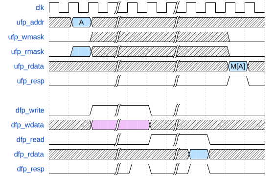

# Pipelined 4-Way Set-Associative Cache

This document details the differences between a state-machined 4-Way
Set-Associative cache (like in `mp_cache`) and its pipelined counterpart. Cache
timing must meet the criteria here to get full credit for a pipelined cache
during advanced features.

# Design Specifications

- 2-stage pipelined:
  - 1 cycle latency in response on cache hits
  - 1 access per cycle throughput on cache hits

# Cache Timing Requirements

The cache must obey the following timing requirements:

## Hits

  
Read hit timing diagram
 

  
Write hit timing diagram
 

  
Mixed hit timing diagram
 

## Clean Misses

  
Read with clean miss timing diagram
 

  
Write with clean miss timing diagram
 

## Dirty Misses

  
Read with dirty miss timing diagram
 

  
Write with dirty miss timing diagram
 

# Architecture

In a state-machined design the entire cache serves one request at a time, which
is the primary source of inefficiency. All control signals come from the
explicit state machine which dictates the current status of the cache.

For the pipelined version, while the current request has been registered on the
pipeline register (including the register in SRAM) and been processed, another
request is already lined up on the input of the pipeline register. This way, you
can achieve the ideal throughput of 1 request serviced per cycle. There is still
"state" in this pipelined cache, but it is now implicitly encoded and control
signals will come from performing logic on these states. Say, for example, the
condition for writing back is "if the current status on the right hand side
stage says it is a miss and dirty". While waiting for the DFP to finish, you
would of course want to stall the pipeline. Once the writeback is done, you can
now change the "state" by marking this line as clean. The combinational logic
will then realize that this is a clean miss, after which the cache will continue
to stall and start fetching the line. After the DFP response, you will update
the "state" by writing the new line into the data array and updating the tag,
valid and dirty bits. On the next cycle, everything will now look like a hit.
